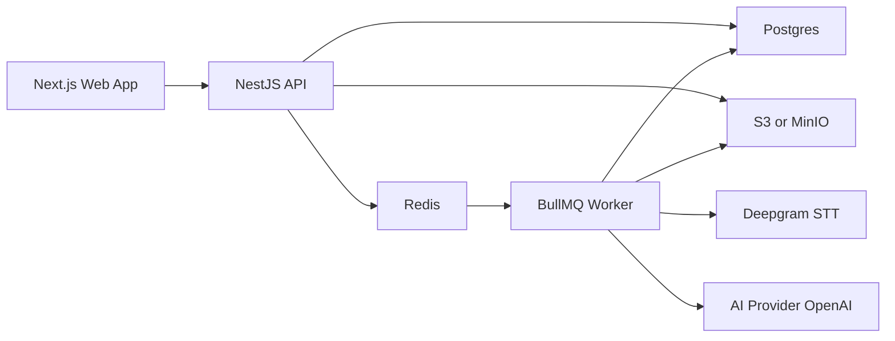

# DocEdge

Production-ready, scalable **clinical intelligence** platform (not a copilot) for clinics.

**DocEdge** is an AI-powered clinical platform that helps doctors **capture, understand, and act on patient data in real time**.

## Current capabilities (implemented)

### API
- **Auth**
  - `POST /auth/register-doctor` — create clinic + register doctor
  - `POST /auth/login` — JWT login
- **Patients** (JWT-protected)
  - `POST /patients` — create patient (`fullName`, optional `phone`, optional `sex: male|female|other`)
  - `GET /patients` — list patients
  - `GET /patients/:id` — get patient
  - `GET /patients/:id/timeline` — patient timeline
  - `GET /patients/:id/consultations` — consultations for patient
  - `GET /patients/:id/artifacts?kind=audio|document|image` — artifacts for patient
- **Consultations** (JWT-protected)
  - `POST /consultations/start` — start session (`patientId`, optional `inputLanguage: en|hi|hi-en`)
  - `POST /consultations/:id/stop` — stop session + attach `audioObjectKey`
  - `GET /consultations/:id` — get consultation
  - `GET /consultations/:id/status` — processing status
  - `PATCH /consultations/:id/soap` — update SOAP sections (manual edit)
- **Uploads / artifacts** (JWT-protected)
  - `POST /uploads/presign` — presign PUT to S3/MinIO (`kind: audio|document|image`)
  - `POST /uploads/register` — register uploaded artifact in DB
  - `GET /uploads/artifacts/:id/presign-get` — presign GET for artifact download

### Background processing pipeline
- **Async worker** (BullMQ `consultation` queue): **S3/MinIO audio → Deepgram STT → (optional) translate to English → OpenAI SOAP note + insights → persist**
- Adds a patient timeline event: `consultation_completed`



### Web UI (Next.js)
- `/login`
- `/patients` (list)
- `/patients/[id]` (detail)
- `/consultations/[id]` (detail)

## Monorepo layout
```
apps/
  api/   NestJS API + background worker (BullMQ)
  web/   Next.js (doctor dashboard + patient link)
infra/
  docker-compose.yml (postgres, redis, minio)
```

## Local dev

### Option A: Docker Compose (recommended)

See `infra/README.md`.

Quick start:
```bash
cp .env.example .env

docker compose --env-file .env -f infra/docker-compose.full.yml up -d --build
```

URLs:
- Web: http://localhost:3000
- API: http://localhost:3002

### Option B: Run apps locally (pnpm)

1) Copy env
```bash
cp .env.example .env
```

2) Start infra
```bash
pnpm infra:up
```

3) Run API
```bash
cd apps/api
pnpm dev
```

4) Run Web
```bash
cd apps/web
pnpm dev
```

## Notes
- **STT provider** default is `deepgram` (highest accuracy in many noisy clinical settings). Configure `DEEPGRAM_API_KEY`.
- **AI provider** default is `openai`. You can later switch `AI_PROVIDER=internal` and plug your model.
